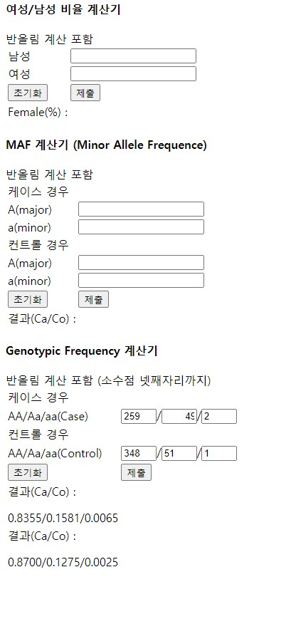

### 유전학 연구실 [웹 계산기]  
설명 : 어쩌다 삘 받아서 만든 웹 계산기    
Genotyping Frequency와 MAF 그리고 성별 비율을 자동으로 계산해준다.    
  
요구사항을 작성하고 그에 따라 프로젝트를 만든다.    
클라이언트는 ajax 통신을 이용해 입력을 서버에 보내고    
서버는 입력을 받아 계산의 결과값을 json 형태로 응답한다.    
  
원칙상 API 명세서를 만들어야 하나.   
아직 Swagger 사용이 미숙하므로 나중에 API 명세서를 업데이트 하도록 한다.  
  
#### BackEnd
- nodejs
- express
#### FrontEnd
- html/css/javascript

#### 실제 작동

